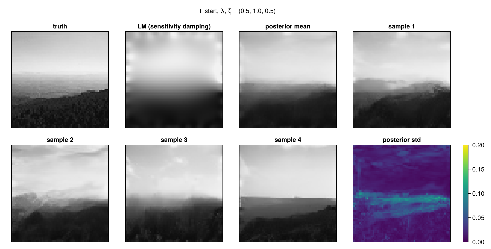
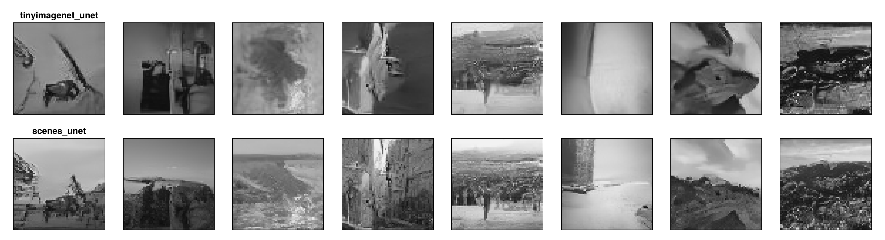

# EITDenoiser.jl

Diffusion-model priors for electrical impedance tomography, as a companion to
[ModularEIT.jl](https://github.com/DanielBoigk/ModularEIT.jl).

- **Networks** ([Lux.jl](https://github.com/LuxDL/Lux.jl), compiled with
  [Reactant.jl](https://github.com/EnzymeAD/Reactant.jl) for the GPU): a residual U-Net with a
  self-attention bottleneck (`UNet`, `unet_tinyimagenet64`) and a purely local CNN
  (`LocalScoreNet`), both predicting the noise of the variance-preserving SDE.
- **Training** (`train_noise_predictor`, `noisy_batch`, `load_image_folder`): denoising score
  matching on grayscale image folders, horizontal flips only (natural scenes have an up and a
  down).
- **Sampling** (`diffusion_sample`, `NoisePredictor`): reverse diffusion (DDIM with a fraction `ζ`
  of fresh noise per step), started from pure noise or from a noised reference image (SDEdit),
  with an optional data-consistency step after every clean-image estimate (DiffPIR).
- **EIT data consistency** (`LinearizedData`, `data_prox`, `pixel_consistency`): the EIT
  residual linearized at a reconstruction, `r(θ) ≈ r₀ + J (θ - θ₀)`, and its proximal step via
  the SVD of `J`. Directions the data determine are taken from the data, the others from the
  prior. That is the confidence weighting of ModularEIT's `resolution_map`, applied in every
  diffusion step, and it needs no PDE solve during sampling. The ModularEIT extension builds
  `LinearizedData` from any ModularEIT least-squares objective.

## Pretrained models

`pretrained_unet(name)` loads a 64 × 64 grayscale U-Net (2.0 M parameters):

| name | data |
|---|---|
| `tinyimagenet_unet` | TinyImageNet (100 000 images), rotations and flips |
| `scenes_unet` | fine-tuned from it on 6 927 natural-scene images (Intel scene classification data: buildings, forest, glacier, mountain, sea, street), horizontal flips only; the EIT test image 1096 and 200 validation images are held out |

`pretrained/tinyimagenet_localcnn` holds the local CNN trained on TinyImageNet.

`scripts/train_scenes.jl` reproduces the fine-tuning.

## Example: a landscape from 32 electrodes

`examples/landscape_eit.jl` sets up the EIT problem of ModularEIT's
[landscape showcase](https://danielboigk.github.io/ModularEIT.jl/dev/tutorials/showcase_landscape/)
on 64 × 64 pixels: 32 electrodes, data from a finer mesh with 1 % noise, and the
sensitivity-damped Levenberg–Marquardt reconstruction. `examples/landscape_diffusion.jl` draws
posterior samples with the diffusion prior, started from the noised reconstruction;
`examples/plot_diffusion.jl` plots them.



Relative L² errors against the 64 × 64 truth (8 samples, 50 steps, `t_start = 0.5`, `ζ = 0.5`):

| | error | misfit / noise level |
|---|---|---|
| Levenberg–Marquardt, sensitivity damping | 0.163 | 0.78 |
| diffusion samples, TinyImageNet prior | 0.224 ± 0.057 | 0.8–1.4 |
| diffusion samples, scene prior | 0.185 ± 0.020 | 0.8–1.0 |
| posterior mean, scene prior | 0.160 | 0.8 |

The samples agree where the data determine the conductivity: the height of the horizon, the
bright sky, the dark ridge. They differ where the data are silent: haze bands, clouds, the exact
outline of the ridge. Their standard deviation marks that band. Each sample fits the nonlinear
EIT data at the noise level, although the sampler only uses the data linearized at the
reconstruction. Individual samples carry texture and therefore have a larger L² error than
smooth estimates; the posterior mean is slightly better than the reconstruction it started from.

Unconditional samples of the two priors (top: TinyImageNet, rotated objects; bottom: fine-tuned on
natural scenes, upright landscapes):



```julia
using EITDenoiser, ModularEIT
ld = LinearizedData(obj, θ_lm; noise)                   # EIT linearized at the reconstruction
dc = pixel_consistency(ld, pixels; range = (0.2, 1.0))  # data-consistency map for the sampler
model, ps, st = pretrained_unet("scenes_unet")
ε̂ = NoisePredictor(model, ps, st)                       # compiled for the GPU
X = diffusion_sample(ε̂, VPSchedule(), x_ref; reference = x_ref, t_start = 0.5, ζ = 0.5,
                     consistency = dc)                   # one sample per column of x_ref
```

## Theory

The background lives in the [ModularEIT.jl wiki](https://danielboigk.github.io/ModularEIT.jl/dev/wiki/):
[Diffusion Models](https://danielboigk.github.io/ModularEIT.jl/dev/wiki/12-Diffusion-Models/),
[DiffPIR](https://danielboigk.github.io/ModularEIT.jl/dev/wiki/12-Diffusion-Models/DiffPIR) (with the linearized EIT data consistency used here),
[Resolution and Confidence Maps](https://danielboigk.github.io/ModularEIT.jl/dev/wiki/08-Regularization/Resolution-and-Confidence-Maps),
and on architectures for non-rectangular domains:
[Networks on EIT Domains](https://danielboigk.github.io/ModularEIT.jl/dev/wiki/13-Geometric-Learning/Networks-on-EIT-Domains),
[Masked and Partial Convolutions](https://danielboigk.github.io/ModularEIT.jl/dev/wiki/13-Geometric-Learning/Masked-and-Partial-Convolutions),
[Conformal Transplantation of Networks](https://danielboigk.github.io/ModularEIT.jl/dev/wiki/13-Geometric-Learning/Conformal-Transplantation-of-Networks),
[Graph Convolutions on Finite Element Meshes](https://danielboigk.github.io/ModularEIT.jl/dev/wiki/13-Geometric-Learning/Graph-Convolutions-on-Finite-Element-Meshes),
[Diffusion Models on Finite Element Spaces](https://danielboigk.github.io/ModularEIT.jl/dev/wiki/12-Diffusion-Models/Diffusion-Models-on-Finite-Element-Spaces).

## Tests

```julia
julia --project -e 'using Pkg; Pkg.test()'
```
